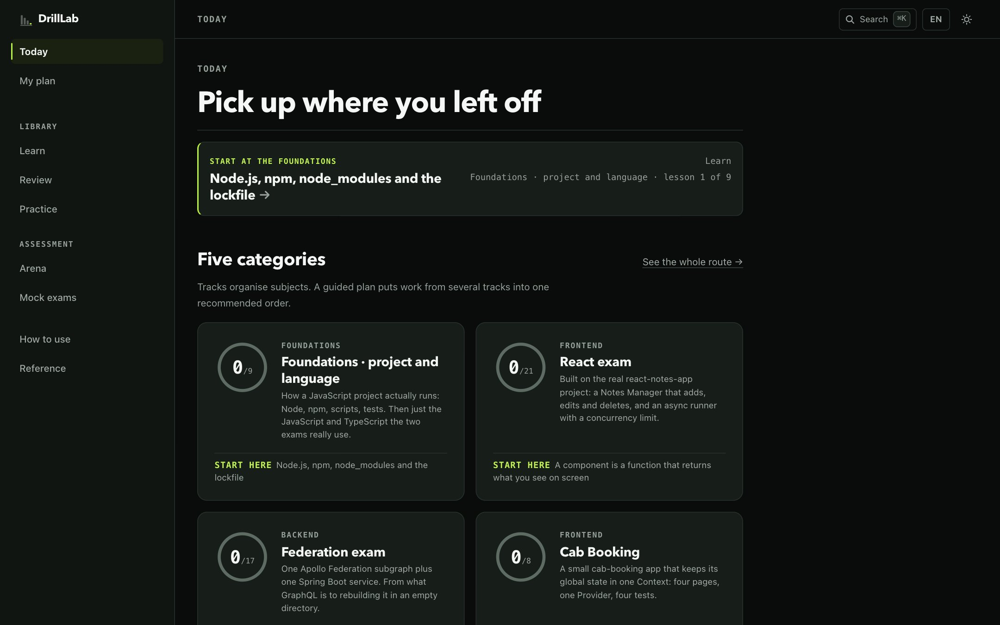
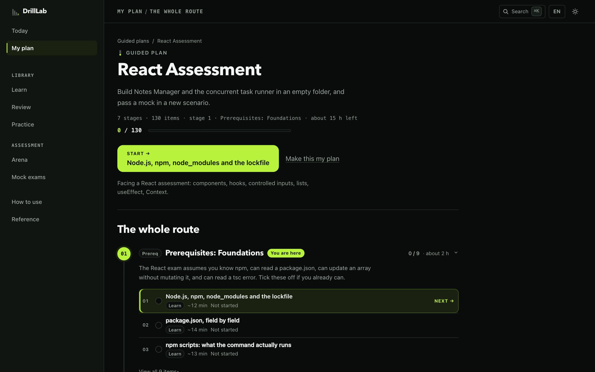

# DrillLab — Practising Until You Can Do It Alone

A study app I built for myself. The goal is not "I understood the solution" — it is
**writing it in an empty folder, with no answer in front of you**.

## Where the material comes from

While learning React, GraphQL and Spring Boot, I kept running into problems and concepts
that were more interesting than the tutorials around them — some from things I read, some
from formats friends described, some I hit myself and had to work out. I wanted somewhere to
put them so I could come back and practise, rather than re-reading the same articles and
mistaking recognition for ability.

**Everything here is written by me.** The problems are my own, built to exercise the ideas
they came from; the lessons are my own explanations; the reference solutions are mine. If a
problem was inspired by a format I had seen, I wrote a new scenario for it rather than
reproducing anything. It is a study project, and it is public in case it is useful to
someone learning the same things.



*The home — one line to resume, five tracks with their progress, and the single-drill counts. It asks nothing before letting you in.*



*A guided plan — numbered stages, an obvious current position, and exactly one next item*

## Two ways in

**Guided plans** answer "tell me what to do next." Pick an outcome and you get an
ordered, resumable route that crosses the four modes: which lessons to read, which
topics to revise, which exercises and problems to do, and finally the same thing in
an empty folder.

| Plan | Stages | Items | Ends with |
| --- | --- | --- | --- |
| Complete DrillLab | 20 | 350 | every rebuild, every mock, all 105 questions |
| React Assessment | 7 | 130 | Support Ticket Board, from an empty folder |
| GraphQL Federation Assessment | 7 | 90 | Book Reviews subgraph, 14 / 14 |
| Spring Boot Controller | 4 | 12 | the controller rewritten in 75 minutes |
| Frontend Interview Review | 8 | 234 | 105 questions answered aloud, 15 problems written |
| Cab Booking | 6 | 38 | the whole app from four tests and one data file |

Plans reference existing material only — no lesson, question or problem is duplicated
into them, and **completion is derived from the progress you already have**. Questions
you rated before picking a plan count towards it; anything you finish inside a plan is
still ticked in the courses.

**The library** answers "let me browse and choose." Nothing is ever locked.

## One navigation, one next action

Everything you can go to lives in the left sidebar, and its positions are identical on
every page. The top bar carries only where you are plus three tools: search, language
and theme.

```
Today  ·  My plan
   your plan's name, stage and progress
   〔 Continue 〕                      ← the one primary action, site-wide
Library     Learn · Review · Practice
Assessment  Arena · Mock exams
How to use  ·  Reference
```

| Section | Routes | What you do there |
| --- | --- | --- |
| **Learn** | `/path`, `/exams/**` | Read the lessons in order, one at a time |
| **Review** | `/drill` | Interview questions and flashcards — no need to start at chapter one |
| **Practice** | `/practice`, `/code` | Lesson exercises, plus coding workspaces that really run the tests |
| **Arena** | `/arena` | Timed, no hints, done in an empty folder |
| **Mock exams** | `/mock` | Score yourself against the rubric after a sitting |

**Continue** exists exactly once. Following a plan, it points at that plan's next
incomplete item; otherwise at the last meaningful thing you were doing — a lesson, a
filtered question set, a coding problem or an arena run. With no history at all it
points at the first Foundations lesson. The two pages whose main content *is* that
action — the home page and a plan's own page — hand it to the page and drop the
sidebar copy, so you never see two large buttons pointing at the same place.

A first-time visitor is asked one question with three answers — learn everything in
order, prepare for a specific assessment, or prepare for interviews — rather than being
shown six dense plan cards at once. Choosing "prepare for an assessment" is what reveals
the four assessments. Once a plan is active the home page becomes a small dashboard:
plan, stage, progress, time left, and one card describing the next task and why it is
next.

## Four tracks

The tracks differ by **how much you are given** — each one hands you less than the last:

| Track | What it is | What you get | Goal |
| --- | --- | --- | --- |
| `/drill` | 105 short questions | A question; you answer out loud | Be able to say it |
| `/practice` | 148 in-lesson exercises | Blanks already cut, waiting to be filled | Be able to recognise it |
| `/code` | 25 coding problems | Files, dependencies and tests all provided | Be able to write it correctly |
| `/arena` | 7 timed sittings (2 full mocks) | An empty folder, a clock, no hints | Be able to do it from nothing |

`/path` is the course archive — 80 written lessons explaining the ideas behind the
problems. It is a reference to come back to when stuck, not the main line.

The tracks and the modes are two different cuts of the same material: a track says
*how much you are handed*, a mode says *what you are trying to do right now*. The
four tracks live across Review, Practice and Assess.

## What it covers

Five courses: foundations, React, GraphQL Federation, a mixed interview set, and one
Context-based React build. In practice that means React and hooks, TypeScript, GraphQL and
Apollo Federation, Node subgraphs, and a Java Spring Boot service — plus the production
concerns that come with them, like error handling, correlation IDs and configuration.

It starts from "what does `npm install` actually do" and assumes nothing before that.

## Running code in the browser

**Yes, in one place: 21 of the `/code` problems.** Open the workspace and you get a real
editor, a preview and a test panel; hitting "run tests" gives you actual pass/fail output
with diffs and line numbers. Each of those 21 was verified from both ends — the starting
files genuinely fail, and the reference implementation genuinely passes.

This needs network access: the bundler and npm dependencies run on CodeSandbox's remote
service. Offline, it falls back to a "run it locally" card.

The remaining 4 have no sandbox, and each page says why — Node/JVM projects cannot start a
server process inside a browser iframe, and two of them need `fetch` or
`HTMLMediaElement.prototype` stubbed, which this environment cannot intercept (they pass
locally under vitest).

**`/practice`'s "check" does not run code** — it is regex matching after comments are
stripped. It can tell whether you used `filter` instead of `push`; it cannot tell whether
your code actually works. The pages say so explicitly.

**`/arena` and `/mock` deliberately have no runtime.** Not because it is impossible, but
because adding it would remove the hardest and most valuable tier. In exchange, the "how to
run this locally" instructions there have to be exact: commands you can copy verbatim, the
full file tree, and real measured numbers for what you should see before and after.

## Running locally

```bash
npm install
npm run dev        # port 3000 by default

npm run build      # production build
npm run typecheck  # tsc --noEmit
npm run gen:nav    # regenerate content/nav.ts after editing course content
npm run gen:src    # re-snapshot reference projects after editing sourceFiles
```

## Scale

| | Count |
| --- | --- |
| Courses | 5 |
| Modules | 27 |
| Lessons | 80 |
| In-lesson exercises | 148 |
| Debug Labs | 26 |
| Short-answer questions | 105 |
| Coding problems | 25 (21 runnable in the browser) |
| Arena problems | 7 (5 rebuilds + 2 mocks) |
| Guided plans | 6 |
| Prerendered pages | 259 |

## Content integrity rules

The question tracks are **derived** from the lesson content rather than stored twice — two
copies means two truths, and the one you forget to update is the one people read. Every
table asserts its own shape at build time: if a count is off, a number has a gap, or a
referenced exercise cannot be found, **the build fails**.

---

© 2026 Weiren Feng.
