# 这一轮的七件事

分支 `feat/dial-dashboard`。保留深色石墨 + 柠檬绿、圆形仪表盘、侧栏那套导航、
共用的对齐轴，以及全部内容 / 计划 / 进度 / 路由。改的是七处说不清楚的地方。

截图都是 1440×900 和 390×844，英文界面，深色主题（默认那一档）。

| 看什么 | 桌面 | 390px |
| --- | --- | --- |
| 今天（全新） | 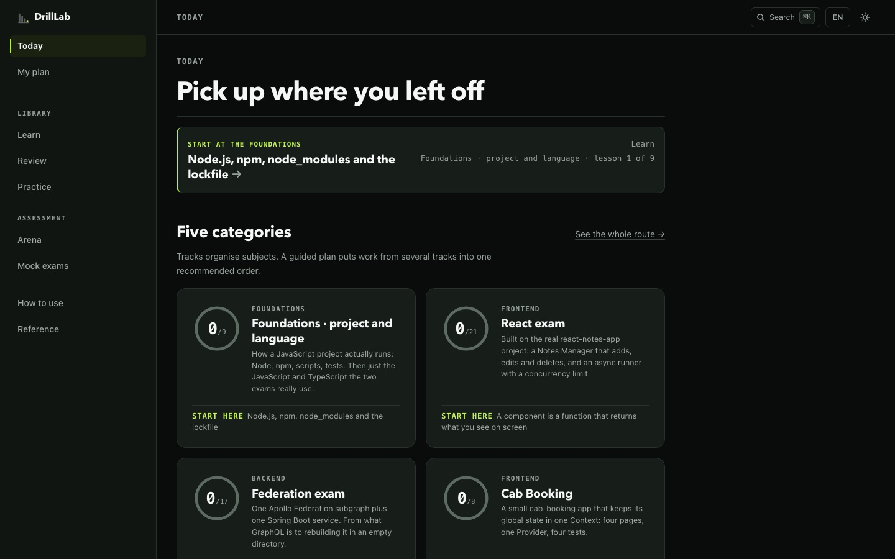 | 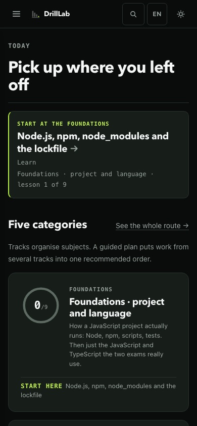 |
| 今天（有进度） | 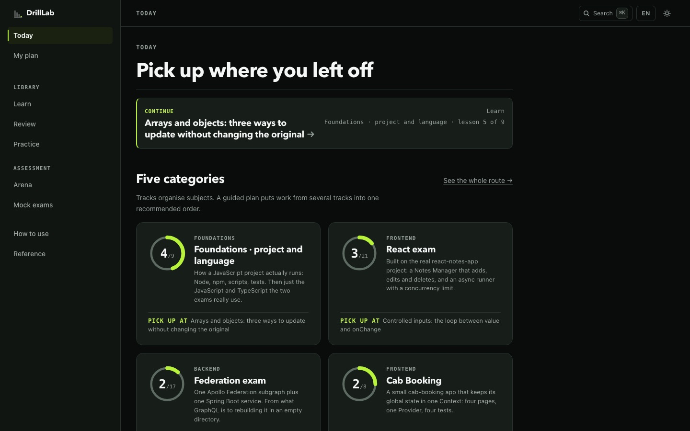 | 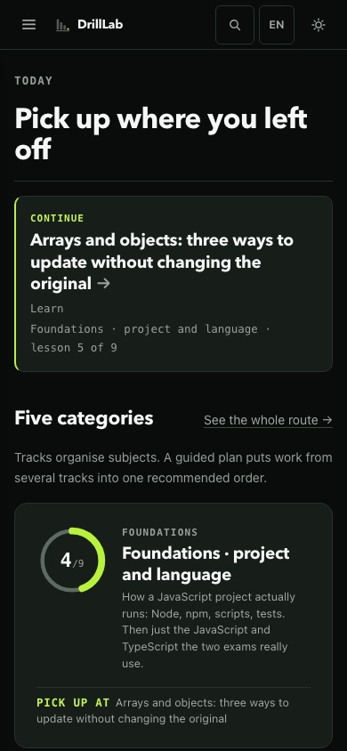 |
| 我的引导计划 | 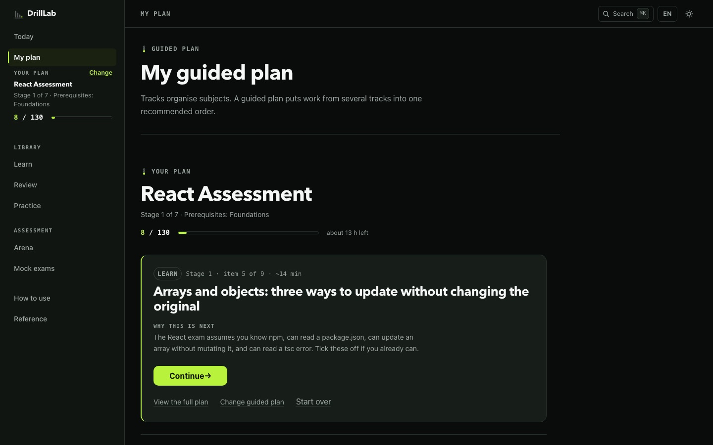 | 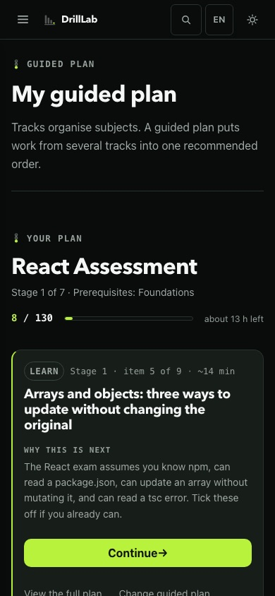 |
| 换一条引导计划 | 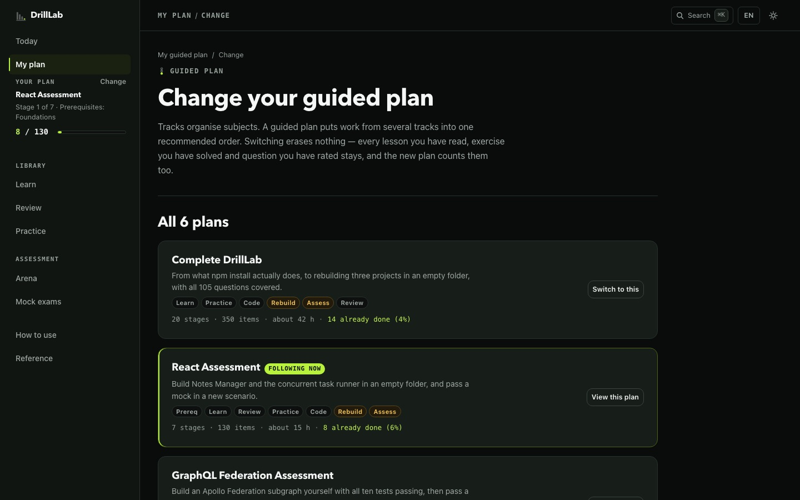 | 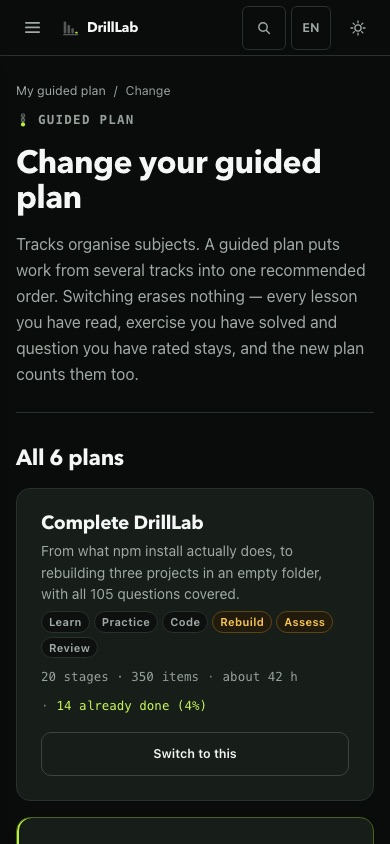 |
| 五张分类卡 | 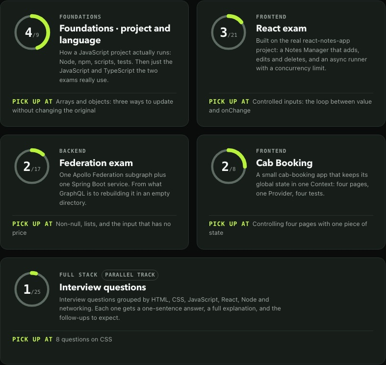 | 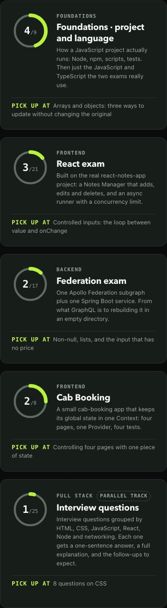 |
| 移动端抽屉 | — | 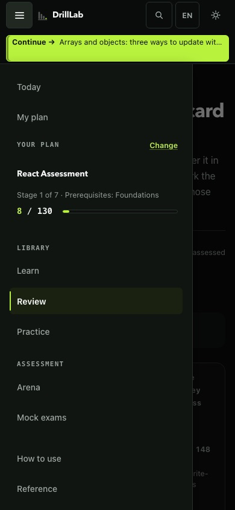 |

## ① 分类不是计划

两个词全站不再混用：

```
分类 track          今天那五个科目分类
引导计划 guided plan 一条横跨学 / 背 / 练 / 写 / 考的推荐顺序，六条
```

它们碰面的地方在「五个分类」这个小标题下面，一行：
**分类整理的是科目，引导计划把几个分类里的东西排成一条推荐顺序。**
放在这儿而不是 `/plans` —— 第一次进来的人在同一屏上看到五张卡和侧栏里的
「我的计划」，等他走到 `/plans` 才解释就晚了。

顺带把第三种「track」清掉了：八股和 coding 列表上的「方向」筛选，
英文原来也叫 Track，现在叫 Topic。

## ② `/plans` 一页一个 h1，「换」有自己的地址

改之前 `/plans` 同时渲染三样东西 —— 三选一、六条的全表、当前计划的仪表盘。
一页里两到三个 h1，而已经在跟计划的人得先滚过一整套「选计划」的界面
才看得到自己的计划。侧栏那个「换一条」更糟：它指向 `/plans`，
而你可能已经站在 `/plans` 上，**点了等于没反应**。

```
/plans          没跟计划 → 三选一（h1 是那个问题）
                跟着计划 → 我的引导计划（仪表盘 + 继续 + 一颗描边的「换一条」）
/plans/choose   只做一件事：当前是哪条、能换成哪些、取消
```

选择页上写清楚了换一条**不会删除任何进度**（完成度是从共享记录推导的，
换计划一条记录都不动）。站在选择页上时，侧栏那个「换一条」不再是链接 ——
指向自己的链接是同一个毛病换了个地址。

`pick()` 用 `router.replace`，所以换完再按返回不会退回选择页。
取消、返回键、换完再返回，三条都实测过。

## ③ 今天只剩三段

```
① 一行「接着上次」
② 五个分类的进度盘
③ 只想单练某一类
```

删掉的两段是重复：「浏览全部材料」把侧栏的四项又摆了一遍，
「你的进度」把五个圆环又画了一遍。它们和「按技术点直接进去」一起收进了
一个折叠，**标题里写明了里面有什么**（包括「清空进度」——
上一版那个折叠的标题一个字都没提它）。

## ④ 五张卡

- **简介是手写的**（`lib/track-copy.ts`），最多两句。上一版用
  `-webkit-line-clamp: 2` 把课程总览页那段三到五行的话截成两行，
  于是五张卡上有五个半截句子。**CSS 不该替人编辑文案。**
- **标题和「点了会去哪」不再截断。** 后者原来是单行省略号，
  会把「从零重写：整个 subgraph」截成读不出去哪的一截。
- **底边栏定高两行**：它是网格最后一行，高度一变，那条分隔线就跟着变 ——
  同一排的两条分隔线因此差了 18px，这就是「看着没对齐」的来源。
  实测 80 节课文 × 七个宽度，只有两节最长的英文标题会收在第二行末尾。
- **零进度不画弧，环底细一档**；有进度之后柠檬绿那道弧是主角。
  环底的颜色没动 —— 它是有意义的图形，WCAG 1.4.11 要 3:1，
  「安静」靠的是粗细，不是调暗。
- **读完了圆环里是一个对勾**，计数留在 `aria-label` 上。
- 第五张横跨整行，用的是同一套内部网格，只是文字收了个阅读宽度。

## ⑤ 顶栏和侧栏

- 顶栏那条「我在哪」深页面给两段（`学课程 / React 考试`），一级页面给一段。
  顶栏是 sticky 的，正文里那条面包屑滚两屏就没了。它**永远不写页面标题** ——
  那在 h1 上。
- 侧栏品牌行和顶栏共用 56px，两边都是 `align-items: center`，
  所以标记、路径、右边那排工具在同一条水平中线上。边框只有一处相交。
- **390px 上留住「DrillLab」字样。** 这是一道算术题：一行要放
  菜单 44 + 字样 76 + 〔继续〕89 + 搜索 44 + 语言 44 + 主题 44 = 341，
  加间隙和内边距在 360px 上实测 377。语言 / 主题不许收进菜单，
  品牌只留标记就是那个「没有说明的图形」，〔继续〕是主动作 ——
  三个都不能去。所以 **≤520px 时顶栏排两行**：第一行品牌加三个工具，
  第二行整条给〔继续〕。顺带那颗按钮终于能把任务名写出来了 ——
  单行时那个名字从 480px 起就被藏掉，按钮上只剩一个光秃秃的「继续」。

## ⑥ 390px

17 个页面 × {360, 390, 414} 逐个可点控件扫过，0 处。这一轮修的三处：

1. 「接着上次」那行的元信息在 720px 以下转成横排时仍然 `white-space: nowrap`，
   在 390px 上量出来 376px 宽，把整页顶到 `scrollWidth 456`；
2. 抽屉里计划名（18px）和「换一条」（21px）是全站最小的两个目标，
   现在抽屉里每一行都 ≥44；
3. 打开抽屉时焦点给了品牌链接，而它在那个宽度是 `display: none`，
   于是焦点留在 body 上，按 Tab 要从整页开头走一遍。现在取第一个看得见的。

## ⑦ 校验

```
typecheck / lint / build（260 个页面）      全过
首屏 JS   首页 153 ≤160   课程页 144 ≤150
          /plans 145 ≤150  计划详情 176 ≤180
对比度    84 组（21 页 × 两个宽度 × 两个主题）   0 处不达标
横向溢出  105 组                                0 页
对齐轴    39 组   顶栏 / 正文 / 侧栏 = 284 / 284 / 28
按钮几何  四个变体各一个高度、一个圆角；字号 9 种
焦点      12 个页面、558 个控件，用真的 Tab 走
标题层级  18 个路由 × 两种档案，每页恰好一个 h1，不跳级，
          没有指向本页的「换一条」，控制台 0 条
流程      引导计划 66 · 换计划 12 · 选择页 36 · 重走 13 · 语言 49
卡片      三种档案 + 最长标题档 × 七个宽度，84 组断言
移动端    17 页 × 三个宽度，0 处
```
