# UI v2 的对齐与组件语言收敛

「像把新皮肤套到旧页面结构上」的三条具体证据，以及修完之后的实测数字。

## 一、之前有八条左边界

1440px 上量到的（元素左边界 + 自身 paddingLeft）：

| 位置 | 之前 | 之后 |
| --- | --- | --- |
| 顶栏「我在哪」 | 276 | **284** |
| 首页 h1 | 453 | **284** |
| 计划页 h1 | 433 | **284** |
| `/drill` h1 | 326 | **284** |
| 课程页 h1 | 284 | **284** |
| 侧栏品牌 | 51 | **28**（图标起点） |
| 侧栏导航行 | 16 | **28** |
| 侧栏上下文段 | 24 / 36 | **28** |

根子是两件事叠在一起：`.ui-page` 居中，而每一页的 `max-width` 又不一样；
侧栏里每个块各自写内边距。现在三个变量定死（`--gutter` / `--rail-pad` /
`--rail-inset`），正文一律左对齐不居中。

**回归：13 个页面 × 3 个宽度 = 39 组，三条轴必须是 284 / 284 / 28，不一致 0 处。**

## 二、侧栏里曾经有八种视觉语言

品牌、导航行、组标题、一张有边框的计划卡、〔继续〕、模式眉题、全局进度条、
课程行加一枚柠檬绿药丸；下半段还有三个描边的统计格、一张描边的「下一节」卡、
两个并排的描边子模式方块 —— 四种边框。

现在只剩两种：**能去的行**（34–36px、文字轴 28、选中时左边一条 2px 竖线）
和**那一颗填充的主动作**。顺带删掉的：

- `✦` —— 平行支线那行的字符，在这一版的几何字族里没有字形，渲染成一个空方块；
- 柠檬绿的 `Start here` 药丸 —— 侧栏里唯一该填充的是那颗〔继续〕；
- 「LEARN」那一层标题 —— 模式名在主导航里已经高亮着了；
- 「3 / 80」全局进度 —— 它正上方就是计划的 4 / 130，两个总量条叠在一起。

## 三、选了计划之后没法换

实测过：选完之后首页和侧栏加起来**一个换计划的入口都没有**。
现在两处常驻 —— 侧栏计划块眉题右边的「换一条」，和首页〔继续〕下面的
「看全程 / 换一条计划」。

## 前后对照

| | 之前（UI v2 初版） | 之后 |
| --- | --- | --- |
| 首页 · 新访客 |  | 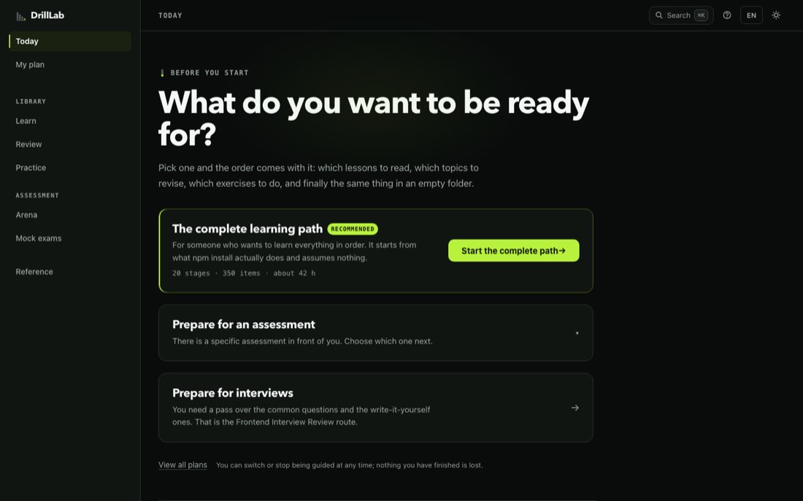 |
| 首页 · 跟着计划 | 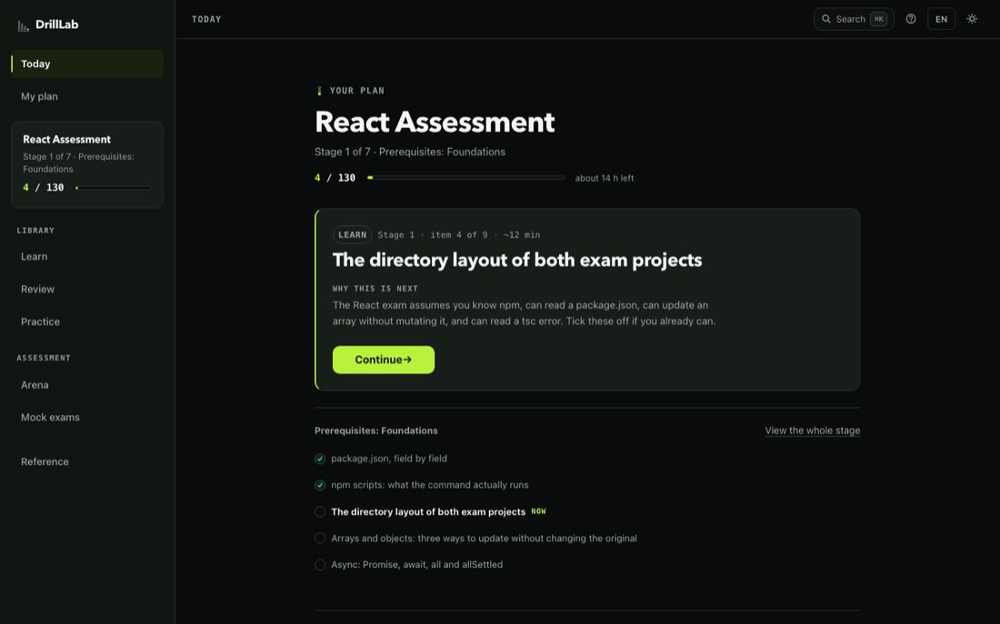 | 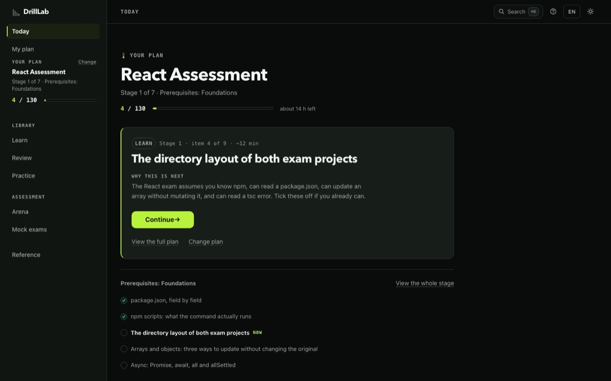 |
| 计划页 |  | 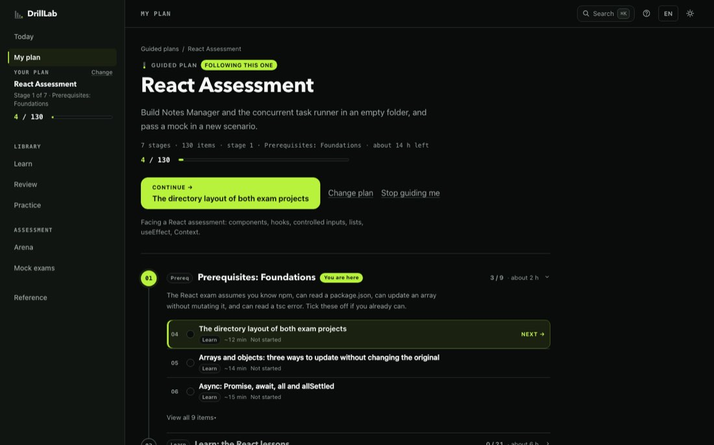 |
| 课程页 |  | 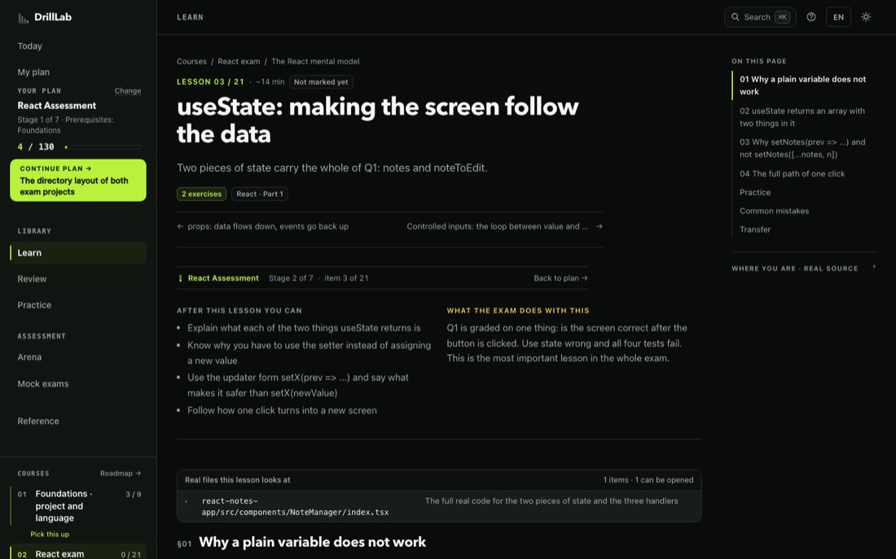 |
| 做练习 |  | 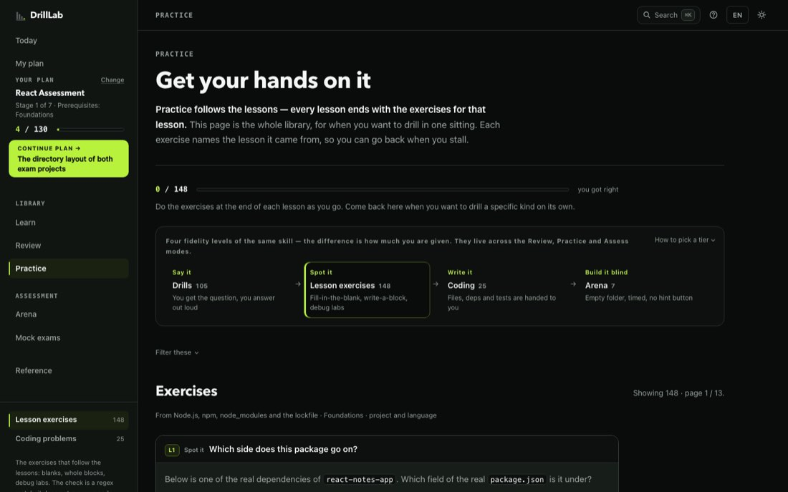 |
| 背知识点 |  | 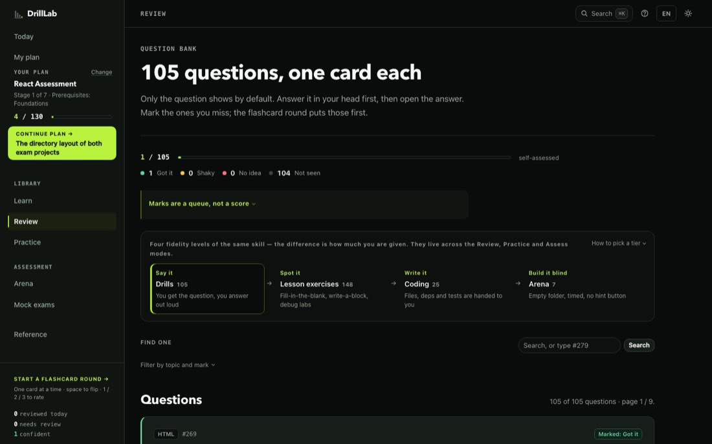 |
| Coding | 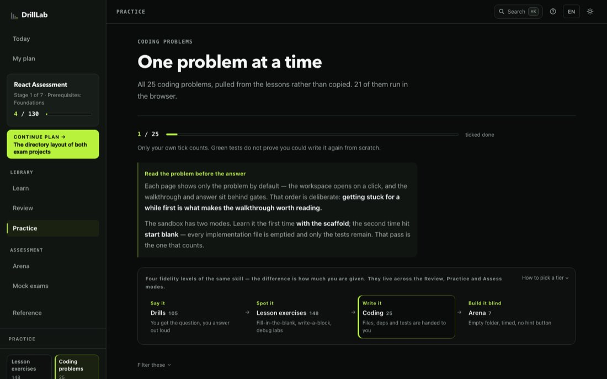 | 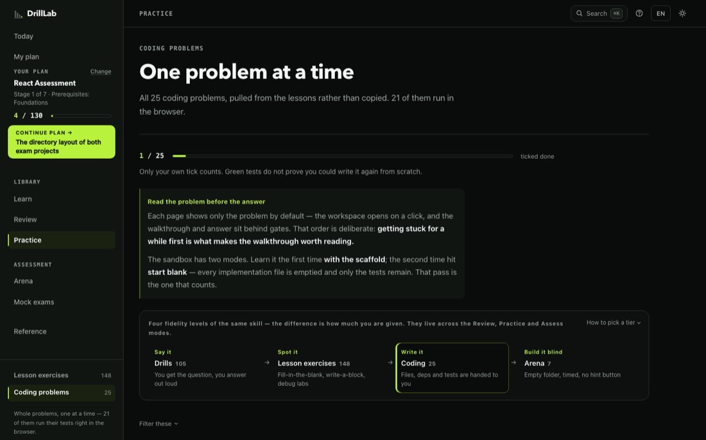 |
| 首页 390px | 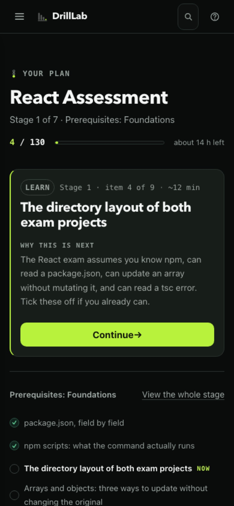 | 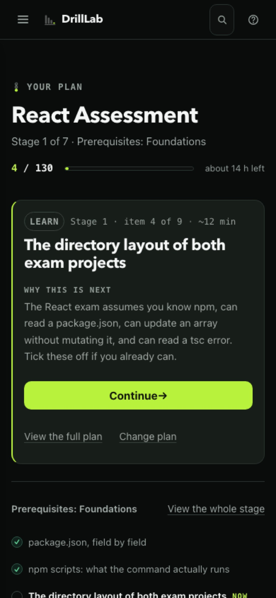 |
